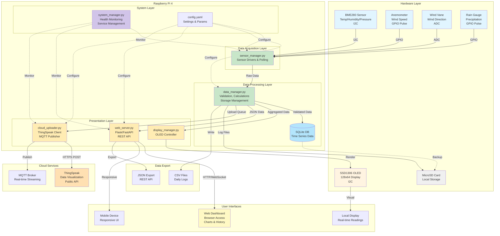

# Micro Weather Station Proposal
## For Kerala Government Agency

---

## Table of Contents

1. [Executive Summary](#executive-summary)
2. [Project Objectives](#project-objectives)
3. [Hardware Architecture](#hardware-architecture)
   - [Primary Platform: Raspberry Pi](#primary-platform-raspberry-pi-recommended-configuration)
   - [Sensor Suite](#sensor-suite)
   - [Display & User Interface](#display--user-interface)
   - [Data Storage & Connectivity](#data-storage--connectivity)
   - [Enclosure & Mounting](#enclosure--mounting)
4. [System Architecture Overview](#system-architecture-overview)
5. [Software Architecture](#software-architecture)
   - [Operating System & Runtime](#operating-system--runtime)
   - [Software Components](#software-components)
   - [Software Deployment](#software-deployment)
6. [Data Management](#data-management)
   - [Data Schema](#data-schema)
   - [Storage Strategy](#storage-strategy)
7. [Implementation Timeline](#implementation-timeline)
8. [Budget Estimate](#budget-estimate-all-prices-in-inr-inclusive-of-gst)
   - [Base Configuration](#base-configuration-per-unit)
   - [Optional Enhancements](#optional-enhancements-per-unit)
   - [Bulk Procurement Discount](#bulk-procurement-discount-government-rate)
   - [Installation & Deployment Costs](#installation--deployment-costs-one-time-per-site)
   - [Annual Maintenance & Operation Costs](#annual-maintenance--operation-costs-per-unit)
   - [Total Cost of Ownership](#total-cost-of-ownership-5-year-projection)
   - [Funding Sources & Support](#funding-sources--support)
9. [Technical Specifications](#technical-specifications)
   - [Measurement Capabilities](#measurement-capabilities)
   - [Sampling & Update Rates](#sampling--update-rates)
   - [Power Requirements](#power-requirements)
   - [Environmental Operating Conditions](#environmental-operating-conditions)
10. [Advantages & Benefits](#advantages--benefits)
    - [Educational Value](#educational-value)
    - [Research Applications](#research-applications)
    - [Technical Advantages](#technical-advantages)
11. [Challenges & Mitigation](#challenges--mitigation)
12. [Future Expansion Possibilities](#future-expansion-possibilities)
13. [References & Resources](#references--resources)
14. [Conclusion](#conclusion)
    - [Strategic Value for Kerala](#strategic-value-for-kerala)
    - [Recommended Deployment Strategy](#recommended-deployment-strategy)
15. [Approval & Next Steps](#approval--next-steps)

---

## Executive Summary

This document outlines the design and implementation plan for a comprehensive micro weather station for deployment across Kerala for educational, research, and meteorological monitoring purposes. The system will collect meteorological data including temperature, humidity, barometric pressure, wind speed/direction, and precipitation, with multiple data access and storage options suitable for India Meteorological Department (IMD) standards and local government requirements.

## Project Objectives

1. **Educational Goals**: Provide hands-on experience with sensor integration, data collection, and IoT systems for academic institutions across Kerala
2. **Research Applications**: Generate reliable meteorological data for analysis and study, supporting Kerala State Disaster Management Authority (KSDMA) initiatives
3. **Multi-platform Access**: Enable data visualization through local displays, web interfaces, and cloud services accessible to government departments
4. **Data Persistence**: Maintain historical records through local and cloud storage for climate studies and agricultural planning
5. **Regional Coverage**: Support Kerala's diverse climate zones from coastal to high-range regions

## Hardware Architecture

### Primary Platform: Raspberry Pi (Recommended Configuration)

**Option A: Raspberry Pi 4** (Full-featured solution)
- Processor: ARM Cortex quad-core
- RAM: 4GB (recommended for government deployment)
- Benefits: Full Linux OS, easy networking, extensive library support
- Power: 5V/3A USB-C
- Estimated Cost: ₹5,500-6,500 (including GST)
- **Availability**: Readily available through authorized Indian distributors

**Option B: Raspberry Pi Pico W** (Budget solution for pilot deployment)
- Microcontroller: RP2040 dual-core
- Benefits: Low power, WiFi built-in, cost-effective
- Power: 5V via micro-USB
- Estimated Cost: ₹500-700
- **Availability**: Available through Indian electronics suppliers

**Recommendation**: Raspberry Pi 4 for government research and monitoring applications due to easier development, debugging, data processing capabilities, and long-term support requirements.

### Sensor Suite

#### 1. Temperature & Humidity
**Primary Sensor: BME280**
- Measures: Temperature (-40 to +85°C), Humidity (0-100%), Pressure (300-1100 hPa)
- Interface: I2C or SPI
- Accuracy: ±1°C, ±3% RH (suitable for IMD compatibility)
- Cost: ₹800-1,200
- **Alternative**: DHT22 (lower cost ₹400-500, suitable for pilot projects)
- **Availability**: Widely available through Indian online electronics suppliers

**Rationale**: BME280 provides three measurements in one sensor, reducing complexity and cost. Meets accuracy requirements for monsoon and climate monitoring.

#### 2. Wind Speed & Direction
**Option A: Professional Weather Meter Kit**
- Wind Speed: Hall effect sensor, output frequency proportional to speed
- Wind Direction: Potentiometer with 16-direction resolution
- Interface: GPIO (digital pulse counting + ADC)
- Range: 0-70 m/s (0-157 mph) - suitable for Kerala's cyclone monitoring
- Cost: ₹6,500-9,500 (imported kits)
- **Alternative**: Locally manufactured anemometers (₹3,500-5,000)

**Recommendation**: Consider local manufacturers from Pune or Bengaluru for cost-effectiveness and easier maintenance support.

#### 3. Rain Gauge
**Tipping Bucket Rain Gauge** (Critical for Kerala's monsoon monitoring)
- Resolution: 0.2794mm per tip
- Interface: GPIO (pulse counting)
- Cost: ₹2,500-4,000 (standalone) or included in weather meter kit
- **Calibration**: Calibrated for Indian monsoon rainfall patterns
- **Availability**: Available from Indian meteorological equipment suppliers

#### 4. Additional Sensors (Optional Enhancements for Comprehensive Monitoring)
- **UV Sensor** (VEML6075): UV index measurement - ₹600-800
- **Light Sensor** (TSL2591): Ambient light/lux - ₹600-800
- **Soil Moisture** (Capacitive): For agricultural research - ₹400-600
- **Air Quality Sensor** (PMS5003): PM2.5/PM10 monitoring - ₹2,500-3,500 (relevant for urban areas)

### Display & User Interface

**Local Display: SSD1306 OLED (128x64)**
- Interface: I2C
- Benefits: Low power, good visibility in Kerala's bright sunlight, compact
- Cost: ₹700-1,000
- Displays: Real-time readings in both English and Malayalam (optional), min/max values, trend indicators
- **Availability**: Readily available through Indian suppliers

### Data Storage & Connectivity

1. **MicroSD Card**: 32GB minimum (₹400-600) - SanDisk/Samsung for reliability
2. **WiFi**: Built-in (Pi 4) - compatible with government network infrastructure
3. **4G/LTE Option**: USB dongle for remote locations (₹1,500-2,500) - supports BSNL/Jio/Airtel
4. **Optional**: Battery backup (UPS HAT ₹2,500-3,500) for continuous operation during power cuts

### Enclosure & Mounting

**Weather-resistant Enclosure** (Monsoon-rated for Kerala climate):
- IP65-rated ABS plastic enclosure (UV-resistant)
- Ventilated radiation shield for temperature sensor (Stevenson screen design)
- Mounting pole/bracket for outdoor installation (stainless steel for coastal corrosion resistance)
- Cable glands for sensor wiring (waterproof)
- Corrosion-resistant hardware suitable for Kerala's humid coastal climate
- Cost: ₹2,500-4,000 (locally sourced from Kerala/Tamil Nadu manufacturers)
- **Local Vendors**: Available through Kochi or Trivandrum industrial suppliers

## System Architecture Overview



## Software Architecture

### Operating System & Runtime
- **OS**: Raspberry Pi OS Lite (Debian-based)
- **Language**: Python 3.10+
- **Benefits**: Extensive library ecosystem, rapid development

### Software Components

#### 1. Data Acquisition Layer
```
sensor_manager.py
├── BME280 driver (temperature, humidity, pressure)
├── Anemometer driver (wind speed)
├── Wind vane driver (wind direction)
└── Rain gauge driver (precipitation)
```

**Key Libraries**:
- `adafruit-circuitpython-bme280`: BME280 interface
- `RPi.GPIO`: GPIO pin management for wind/rain sensors
- `smbus2` or `board`: I2C communication

#### 2. Data Processing & Storage
```
data_manager.py
├── Data validation & filtering
├── Statistical calculations (averages, min/max)
├── Local SQLite database
└── CSV export functionality
```

**Features**:
- Sampling interval: 1-60 seconds (configurable)
- Aggregation: 1-minute, 5-minute, hourly, daily summaries
- Anomaly detection: Filter out sensor errors

#### 3. Display Controller
```
display_manager.py
├── OLED driver (SSD1306)
├── Screen layouts (multiple pages)
└── Auto-refresh cycle
```

**Display Pages**:
- Page 1: Current temperature, humidity, pressure
- Page 2: Wind speed, direction, gusts
- Page 3: Rainfall (hourly, daily)
- Page 4: Trends and forecasts

#### 4. Web Interface
```
web_server.py
├── Flask/FastAPI web server
├── RESTful API endpoints
└── HTML/JavaScript dashboard
```

**Features**:
- Real-time data updates via WebSocket/AJAX
- Historical data visualization (charts)
- Data export (CSV, JSON)
- Configuration interface
- Responsive design (mobile-friendly)

#### 5. Cloud Integration
```
cloud_uploader.py
├── ThingSpeak API client
├── MQTT publisher (optional)
└── AWS IoT/Azure IoT (advanced)
```

**Cloud Platform Options**:
- **ThingSpeak**: Free tier, 8 fields, 15-second intervals - **Recommended for educational use**
- **Blynk**: Mobile app integration
- **Custom**: AWS IoT, Google Cloud IoT, Azure IoT Hub

#### 6. System Management
```
system_manager.py
├── Service monitoring & auto-restart
├── System health checks
├── Error logging
└── OTA updates (optional)
```

### Software Deployment
- **Service Management**: systemd services for auto-start
- **Version Control**: Git repository
- **Configuration**: YAML/JSON config files
- **Logging**: Python logging module with rotation

## Data Management

### Data Schema
```json
{
  "timestamp": "2025-11-08T10:30:00Z",
  "temperature": 22.5,
  "humidity": 65.3,
  "pressure": 1013.25,
  "wind_speed": 3.2,
  "wind_direction": 270,
  "wind_gust": 5.1,
  "rainfall": 0.28,
  "dewpoint": 15.8,
  "heat_index": 23.1
}
```

### Storage Strategy
1. **Local SQLite**: Continuous logging, 1-year retention
2. **SD Card CSV**: Daily files for backup and analysis
3. **Cloud**: Real-time streaming to ThingSpeak (every 15-60 seconds)
4. **Aggregated Data**: Hourly/daily summaries for long-term storage

## Implementation Timeline

### Phase 1: Hardware Assembly (Week 1-2)
- [ ] Procure all components
- [ ] Assemble sensor connections on breadboard
- [ ] Test individual sensors
- [ ] Design and prepare enclosure
- [ ] Mount sensors in weather-proof housing

### Phase 2: Software Development (Week 3-4)
- [ ] Set up Raspberry Pi OS and development environment
- [ ] Implement sensor drivers and data acquisition
- [ ] Create local database and logging system
- [ ] Develop OLED display interface
- [ ] Build web server and dashboard

### Phase 3: Integration & Testing (Week 5)
- [ ] Integrate all software components
- [ ] Configure cloud service (ThingSpeak)
- [ ] System testing and calibration
- [ ] Error handling and edge case testing
- [ ] Performance optimization

### Phase 4: Deployment & Validation (Week 6)
- [ ] Install weather station outdoors
- [ ] Configure systemd services for auto-start
- [ ] Validate data accuracy against reference station
- [ ] Document installation and operation procedures
- [ ] Begin long-term data collection

### Phase 5: Enhancement (Ongoing)
- [ ] Add data analysis and forecasting algorithms
- [ ] Implement alerting system (extreme weather)
- [ ] Mobile app development (optional)
- [ ] Solar power integration (optional)

## Budget Estimate (All prices in INR, inclusive of GST)

### Base Configuration (Per Unit)

| Component | Cost (INR) | Notes |
|-----------|------------|-------|
| Raspberry Pi 4 (4GB) | ₹5,500 | Core platform - authorized distributor |
| BME280 Sensor | ₹1,000 | Temp/humidity/pressure |
| Weather Meter Kit (Wind + Rain) | ₹8,000 | Imported kit or ₹5,000 for local |
| SSD1306 OLED Display | ₹800 | Local display |
| MicroSD Card (32GB) | ₹500 | SanDisk/Samsung Class 10 |
| Power Supply (5V/3A) | ₹800 | Official Pi adapter |
| Weather-resistant Enclosure | ₹3,000 | IP65 rated, monsoon-proof |
| Cables, connectors, PCB | ₹1,500 | Wiring supplies, weatherproof |
| Mounting hardware | ₹1,200 | Stainless steel pole/brackets |
| **Subtotal** | **₹22,300** | **Base configuration** |
| **GST (18%)** | **₹4,014** | **Tax component** |
| **Total per Unit** | **₹26,314** | **Ready to deploy** |

### Optional Enhancements (Per Unit)
| Component | Cost (INR) | Purpose |
|-----------|------------|---------|
| UPS HAT (battery backup) | ₹2,800 | Power outage protection |
| Solar panel + charge controller | ₹5,000 | Off-grid remote locations |
| UV & Light sensors | ₹1,400 | Comprehensive monitoring |
| 4G LTE USB dongle | ₹2,000 | Remote connectivity (BSNL/Jio) |
| Air Quality Sensor (PMS5003) | ₹3,000 | Urban air monitoring |
| Lightning detector | ₹4,500 | Storm warning system |

### Bulk Procurement Discount (Government Rate)

| Quantity | Unit Price | Total Cost | Savings |
|----------|------------|------------|---------|
| 1-5 units | ₹26,314 | ₹26,314 - ₹1,31,570 | - |
| 6-20 units | ₹24,000 | ₹1,44,000 - ₹4,80,000 | 9% discount |
| 21-50 units | ₹22,500 | ₹4,72,500 - ₹11,25,000 | 15% discount |
| 50+ units | ₹21,000 | Contact for quote | 20% discount |

**Note**: Bulk discounts available through GeM (Government e-Marketplace) portal procurement.

### Installation & Deployment Costs (One-time per site)

| Service | Cost (INR) | Notes |
|---------|------------|-------|
| Site survey & assessment | ₹3,000 | Per location |
| Installation labor | ₹5,000 | Including mounting |
| Initial calibration | ₹2,500 | Against IMD reference |
| Documentation & training | ₹4,000 | Per batch of 5 stations |
| Transportation (within Kerala) | ₹1,500 | Per unit |
| **Total Deployment Cost** | **₹16,000** | **Per site** |

### Annual Maintenance & Operation Costs (Per Unit)

| Item | Cost (INR/year) | Notes |
|------|-----------------|-------|
| Internet connectivity (4G) | ₹3,600 | ₹300/month BSNL/Jio |
| Power consumption | ₹1,200 | ~20 kWh/year @ ₹6/unit |
| Cloud service (ThingSpeak Pro) | ₹4,800 | Optional upgrade |
| Annual calibration | ₹2,500 | Once yearly |
| Preventive maintenance | ₹3,000 | Bi-annual service |
| Spare parts buffer | ₹2,000 | 10% of hardware cost |
| **Total Annual Cost** | **₹17,100** | **Operating expenses** |

### Total Cost of Ownership (5-Year Projection)

| Item | Cost (INR) | Notes |
|------|------------|-------|
| Hardware (per unit) | ₹26,314 | One-time |
| Installation (per site) | ₹16,000 | One-time |
| Operation & Maintenance (5 years) | ₹85,500 | ₹17,100 × 5 |
| **Total 5-Year TCO** | **₹1,27,814** | **Per weather station** |
| **Amortized Annual Cost** | **₹25,563** | **Including all expenses** |

### Funding Sources & Support

1. **Central Schemes**:
   - NDRF (National Disaster Response Fund)
   - Ministry of Earth Sciences grants
   - Smart Cities Mission (for urban deployments)

2. **State Schemes**:
   - Kerala State IT Mission support
   - KSDMA disaster preparedness budget
   - Agricultural department research grants

3. **Make in India Initiatives**:
   - Preference for locally manufactured components
   - Assembly within Kerala (potential for skill development)

4. **GeM Procurement**:
   - All components available through Government e-Marketplace
   - Pre-approved vendor listings
   - Transparent pricing and procurement process

## Technical Specifications

### Measurement Capabilities
- **Temperature Range**: -40°C to +85°C (±1°C accuracy)
- **Humidity Range**: 0-100% RH (±3% accuracy)
- **Pressure Range**: 300-1100 hPa (±1 hPa accuracy)
- **Wind Speed**: 0-70 m/s (±0.5 m/s accuracy)
- **Wind Direction**: 16 directions (22.5° resolution)
- **Rainfall**: 0.28mm resolution per tip

### Sampling & Update Rates
- **Sensor Polling**: 1 second (configurable)
- **Display Update**: 2 seconds
- **Local Logging**: Every reading (1s intervals)
- **Cloud Upload**: 15-60 seconds (API rate limits)
- **Web Dashboard**: Real-time via WebSocket

### Power Requirements
- **Operating Voltage**: 5V DC
- **Average Current**: 800mA (Pi 4 + sensors + display)
- **Peak Current**: 1.2A
- **Daily Consumption**: ~19Wh (ideal for solar)

### Environmental Operating Conditions
- **Temperature**: -20°C to +60°C (electronics in enclosure)
- **Humidity**: 0-95% RH (non-condensing in enclosure)
- **Weather Protection**: IP65-rated enclosure
- **Sensor Exposure**: Open-air for accurate readings

## Advantages & Benefits

### Educational Value
1. **Hands-on Learning**: Sensor integration, programming, electronics
2. **Interdisciplinary**: Physics, meteorology, computer science, data science
3. **Real-world Applications**: Weather forecasting, climate study
4. **Scalability**: Can expand with additional sensors

### Research Applications
1. **Microclimate Studies**: Local weather variations across Kerala's diverse terrain (coastal, midland, high-range)
2. **Agricultural Research**: Monsoon prediction, irrigation scheduling for rubber, tea, cardamom cultivation
3. **Environmental Monitoring**: Air quality correlation, impact of Western Ghats on weather patterns
4. **Data Science Projects**: Time series analysis, ML forecasting for Kerala's unique bi-modal monsoon
5. **Disaster Management**: Flood prediction, landslide early warning for vulnerable regions

### Technical Advantages
1. **Modular Design**: Easy to add/remove sensors based on specific regional needs
2. **Multiple Access Methods**: Local + remote monitoring accessible to panchayat/district offices
3. **Open Source**: Complete control and customization, no vendor lock-in
4. **Cost-effective**: ₹26,314 vs ₹1,00,000+ for commercial weather stations (75% cost savings)
5. **Local Support**: Serviceable within Kerala, no dependency on foreign suppliers
6. **Government-ready**: Compatible with NIC network, GeM procurement, IMD data standards

## Challenges & Mitigation

### Challenge 1: Sensor Calibration
**Mitigation**:
- Calibrate against IMD reference stations in Thiruvananthapuram, Kochi, or Kozhikode
- Cross-calibrate multiple sensors before deployment
- Document calibration coefficients and maintain calibration logs
- Annual recalibration schedule aligned with IMD standards

### Challenge 2: Kerala's Harsh Weather (Monsoon, Humidity, Coastal Salt)
**Mitigation**:
- IP65-rated enclosures specifically tested for monsoon conditions
- Stainless steel mounting hardware for coastal corrosion resistance
- Conformal coating on electronics for humidity protection
- UV-resistant plastics for high sunlight exposure
- Regular maintenance schedule (pre-monsoon and post-monsoon)

### Challenge 3: Power Reliability (Frequent outages in rural Kerala)
**Mitigation**:
- UPS HAT for 4-8 hours backup during outages
- Solar panel option for remote high-range locations (Idukki, Wayanad)
- Auto-restart on power recovery with data integrity checks
- Low-power design (~10W average consumption)

### Challenge 4: Data Accuracy in Tropical Conditions
**Mitigation**:
- Implement data validation algorithms for extreme rainfall (>100mm/hour)
- Use quality sensors (BME280) tested for tropical humidity
- Proper sensor placement following IMD guidelines
- Ventilated radiation shield to avoid heat bias in high temperatures

### Challenge 5: Local Language Support & Accessibility
**Mitigation**:
- Web interface available in Malayalam and English
- Training materials in Malayalam for local maintenance staff
- Simple OLED display readable by village-level officials
- SMS alerts in Malayalam for critical weather warnings

### Challenge 6: Internet Connectivity in Remote Areas
**Mitigation**:
- 4G LTE support (BSNL/Jio/Airtel all available in Kerala)
- Local SD card storage as backup (30+ days capacity)
- Offline mode with data sync when connection restored
- Low bandwidth requirements (~500MB/month)

## Future Expansion Possibilities

1. **Advanced Sensors**:
   - Air quality (PM2.5, PM10)
   - CO2 concentration
   - Lightning detector
   - Snow depth (ultrasonic)

2. **AI/ML Integration**:
   - Weather prediction models
   - Anomaly detection
   - Pattern recognition

3. **Network Expansion**:
   - Multiple weather stations (mesh network)
   - Regional weather map
   - Collaborative data sharing

4. **Energy Optimization**:
   - Solar-powered operation
   - Deep sleep modes
   - Wake-on-weather events

## References & Resources

### Indian Government Standards & Guidelines
- **India Meteorological Department (IMD)**: Observational standards and protocols
- **Indian Space Research Organisation (ISRO)**: Satellite data integration possibilities
- **National Disaster Management Authority (NDMA)**: Early warning system requirements
- **Kerala State Disaster Management Authority (KSDMA)**: State-specific requirements
- **Bureau of Indian Standards (BIS)**: IS 5120 (Weather instruments specifications)

### Documentation
- Raspberry Pi Documentation: https://www.raspberrypi.org/documentation/
- BME280 Datasheet: Bosch Sensortec
- Adafruit Learning Guides: https://learn.adafruit.com/

### Weather Station Standards
- World Meteorological Organization (WMO) guidelines
- IMD Manual of Surface Observations
- MOSDAC (Meteorological & Oceanographic Satellite Data Archival Centre) integration

### Software Libraries
- CircuitPython: https://circuitpython.org/
- Flask: https://flask.palletsprojects.com/
- ThingSpeak API: https://thingspeak.com/

### Similar Projects & Benchmarks
- Official Raspberry Pi Weather Station (International)
- IMD Automatic Weather Stations (AWS) specifications
- Commercial Indian weather stations for comparison (Vaisala, Campbell Scientific)

### Procurement Resources
- **GeM Portal**: https://gem.gov.in/ - Government e-Marketplace
- **MSME Vendors**: Kerala-based electronics manufacturers
- **Authorized Distributors**: Raspberry Pi India partners

## Conclusion

This micro weather station proposal presents a comprehensive, government-ready solution for meteorological data collection across Kerala. The Raspberry Pi platform combined with quality sensors provides a robust foundation that is:

- **Cost-effective**: ₹26,314 per unit vs ₹1,00,000+ for commercial stations (75% savings)
- **Locally serviceable**: No dependency on foreign suppliers, maintenance possible within Kerala
- **Scalable**: Modular design allows deployment from 1 to 100+ stations across all 14 districts
- **Standards-compliant**: Compatible with IMD protocols and WMO guidelines
- **Climate-appropriate**: Designed specifically for Kerala's monsoon and coastal conditions

The system's multiple data access methods (local display, web interface, cloud service) ensure accessibility from panchayat to state government levels. With proper installation and calibration against IMD reference stations, this system can provide data quality comparable to commercial weather stations.

### Strategic Value for Kerala

1. **Disaster Preparedness**: Enhanced flood and landslide early warning capabilities
2. **Agricultural Planning**: Precise monsoon tracking for plantation crops (rubber, tea, spices)
3. **Research Excellence**: Support for climate research at Kerala universities
4. **Skill Development**: Technical training for local youth in IoT and meteorology
5. **Make in India**: Potential for local assembly and manufacturing within Kerala

### Recommended Deployment Strategy

**Phase 1 (Pilot)**: 5-10 stations across diverse locations
- Coastal: Alappuzha, Kozhikode
- Midland: Kochi, Thrissur
- High-range: Munnar, Wayanad

**Phase 2 (Expansion)**: 50 stations covering all districts

**Phase 3 (Full Network)**: 100+ stations for comprehensive coverage

## Approval & Next Steps

Upon approval of this proposal, the project team will:

1. **Procurement Phase** (Month 1):
   - Initiate GeM portal procurement for bulk components
   - Identify and shortlist local vendors for enclosures and mounting hardware
   - Secure IMD coordination for calibration access

2. **Development Phase** (Month 2-3):
   - Assemble and test pilot units (5-10 stations)
   - Develop Malayalam language interface
   - Create training materials for maintenance staff

3. **Pilot Deployment** (Month 4):
   - Install pilot stations at identified locations
   - Calibrate against IMD reference stations
   - Begin 3-month data collection and validation

4. **Evaluation & Scaling** (Month 5-6):
   - Evaluate pilot performance and accuracy
   - Refine design based on field experience
   - Prepare for full-scale deployment

5. **Documentation & Training**:
   - Standard Operating Procedures (SOPs) in Malayalam
   - Training programs for district-level staff
   - Integration with KSDMA alert systems

### Contact & Support

**For Technical Queries**: [Technical contact details]
**For Procurement**: GeM Portal or direct tender
**For Calibration**: IMD Regional Meteorological Centre, Thiruvananthapuram

---

**Document Version**: 2.0
**Date**: November 2025
**Prepared for**: Kerala Government Agency - Meteorological Monitoring Initiative
**Platform**: Raspberry Pi 4-based Weather Station System
**Currency**: All costs in Indian Rupees (INR), inclusive of GST
**Compliance**: IMD Standards, WMO Guidelines, BIS IS 5120
