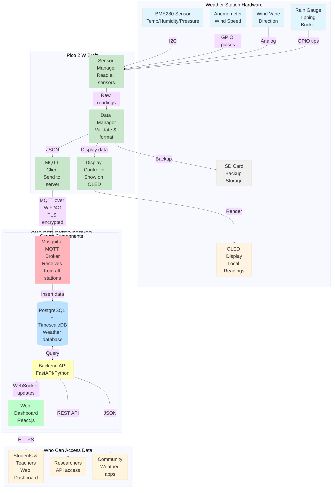

# Micro Weather Station Network for Kerala
### A Learning Project by Curiosity Weekends

---

## About This Project

This proposal explores building an affordable, open-source weather station network for Kerala. Our approach is focused on **learning by doing** - understanding how sensors work, how IoT systems communicate, and how to solve real problems with technology.

**Why we're excited about this:**
- Building something that actually helps communities during floods and agricultural planning
- Learning about microcontrollers, sensors, databases, and cloud systems in one integrated project
- Making professional-grade weather monitoring accessible and affordable

**Our Learning Goals:**
- Master MicroPython programming on microcontrollers
- Understand sensor physics and calibration
- Build real-time data systems with MQTT and databases
- Create interactive dashboards for visualization
- Learn about IoT security and data standards

**What makes this fun:**
- Seeing real weather data we collected ourselves
- Each weather station is like a robot reporting from different parts of Kerala
- Building a network that gets smarter as more stations join
- Contributing to open science and helping our state

**Acknowledgments:**
Special thanks to **Curiosity Weekends** community members for collaboration, brainstorming sessions, and technical discussions that shaped this proposal.

---

## Table of Contents

1. [About This Project](#about-this-project)
2. [What We Want to Build](#what-we-want-to-build)
3. [What We Hope to Achieve](#what-we-hope-to-achieve)
4. [The Hardware - What's Inside Each Weather Station?](#the-hardware---whats-inside-each-weather-station)
   - [The "Brain": Raspberry Pi Pico 2 W](#the-brain-raspberry-pi-pico-2-w)
   - [The Sensors - How We Measure Weather](#the-sensors---how-we-measure-weather)
   - [Display: Little OLED Screen](#display-little-oled-screen)
   - [Storing Data & Getting Online](#storing-data--getting-online)
   - [The Enclosure - Keeping Electronics Safe](#the-enclosure---keeping-electronics-safe)
5. [System Architecture Overview](#system-architecture-overview)
6. [The Central Server - Where All Data Comes Together](#the-central-server---where-all-data-comes-together)
   - [How Stations Talk to the Server: MQTT](#how-stations-talk-to-the-server-mqtt)
   - [The Database - Storing All That Weather Data](#the-database---storing-all-that-weather-data)
   - [Backend API Server](#3-backend-api-server)
   - [Dashboard Web Application](#4-dashboard-web-application)
   - [Authentication & Security](#5-authentication--security)
   - [Our Dedicated Server Setup](#our-dedicated-server-setup)
7. [Software Architecture](#software-architecture)
8. [Data Management](#data-management)
9. [How Schools Can Build This (Timeline)](#how-schools-can-build-this-timeline)
10. [Budget - What Does Each School Need?](#budget---what-does-each-school-need)
11. [Technical Specs - The Geeky Details!](#technical-specs---the-geeky-details)
12. [Why This Project Is Awesome!](#why-this-project-is-awesome)
13. [Challenges We'll Face (And How to Beat Them!)](#challenges-well-face-and-how-to-beat-them)
14. [Future Expansion Possibilities](#future-expansion-possibilities)
15. [References & Resources](#references--resources)
16. [What We're Hoping to Achieve - The Big Picture!](#what-were-hoping-to-achieve---the-big-picture)
17. [How Schools Can Join This Network](#how-schools-can-join-this-network)
18. [Contact & Get Involved](#contact--get-involved)

---

## What We Want to Build

We're proposing a network of DIY weather stations run by **schools and student clubs** across Kerala:
- Each school builds and maintains their own weather station as a hands-on learning project
- Students learn electronics, programming, and meteorology
- All stations send data to one central dashboard
- Create a student-powered weather network across Kerala!
- Schools compete to have the most reliable/accurate station
- Cost around ₹14,300 per school (one-time setup)

**The cool part?**
- Students OWN the learning - they build it, maintain it, understand it
- Real science project that contributes actual useful data
- Schools across Kerala collaborate through shared data
- Science clubs get a long-term project that spans years
- Each station shows that school's name on the network map!

## What We Hope to Achieve

### For Students (Learning by Doing!)
- **Electronics**: Soldering, circuits, sensors, displays
- **Programming**: MicroPython, MQTT, web APIs
- **Science**: Meteorology, data analysis, scientific method
- **Teamwork**: Different students handle hardware, software, maintenance
- **Problem-solving**: Debugging sensor issues, weatherproofing challenges
- **Long-term project**: Maintain and improve over years

### For Schools
- **STEM Education**: Real hands-on project combining physics, CS, math
- **Science Fair Projects**: Students can do research using their own station
- **Inter-school Collaboration**: Compare weather data between schools
- **School Pride**: "Our school contributes to Kerala weather network!"
- **Low Cost**: One-time ₹20,000 (less than most lab equipment)
- **Sustainable**: Students maintain it, no recurring costs except WiFi

### For Kerala
- **Dense Network**: 100+ schools = 100+ weather stations across all districts
- **Hyperlocal Data**: Every school's neighborhood gets weather coverage
- **Student Scientists**: Next generation learns by contributing real data
- **Open Data**: Anyone can access for research, apps, agriculture
- **Community Science**: Schools become community weather hubs

## The Hardware - What's Inside Each Weather Station?

### The "Brain": Raspberry Pi Pico 2 W

Think of this as a tiny computer that costs only ₹700! Here's why we chose it:

**What is it?**
- A microcontroller board (like an Arduino, but more powerful)
- Has WiFi and Bluetooth built-in (super important for sending data!)
- Runs MicroPython - which is way easier to learn than C++
- Size of a stick of gum, uses very little power

**Cool specs** (we researched these from the official Raspberry Pi website):
- **Processor**: RP2350 chip with 2 cores running at 150MHz
- **Memory**: 520KB RAM, 4MB storage
- **Power**: Can run on a phone charger or battery, uses only ~100mA
- **WiFi**: Built-in (no extra modules needed!)
- **Cost**: ₹600-800 from Indian suppliers like Robu.in or Amazon

**Why not use a Raspberry Pi 4?**
- Raspberry Pi 4 costs ₹5,500 (almost 8x more!)
- Uses way more power (bad for solar/battery)
- Overkill for our needs - we don't need a full computer

**Why not use ESP32?**
- Pico 2 W is newer with better security features
- More RAM and storage for our code
- MicroPython support is excellent
- We wanted to try the latest tech!

**What we're learning:**
- How microcontrollers differ from computers
- Why RAM and storage matter for IoT devices
- Power consumption calculations for solar systems
- How WiFi works at a hardware level

### The Sensors - How We Measure Weather

#### 1. Temperature, Humidity & Pressure: BME280 Sensor

This tiny chip (size of your fingernail!) measures three things at once!

**What it does:**
- Temperature: -40°C to +85°C (accurate to ±1°C)
- Humidity: 0-100% (within ±3%)
- Air Pressure: Helps predict if rain is coming!

**How it works** (the fun part):
- Uses I2C protocol (a simple 2-wire connection to talk to the Pico)
- We'll learn to read digital sensor data
- Costs ₹800-1,200 on Amazon/Robu.in

**Why not DHT22?**
- DHT22 is cheaper (₹400) but less accurate
- BME280 gives us pressure data too (bonus!)
- More reliable in humid Kerala weather

#### 2. Wind Speed & Direction: Anemometer

This is the spinning cup thing you see on weather stations!

**How it measures wind:**
- Cups spin faster when wind blows
- A magnet inside creates pulses (like a bike speedometer)
- We count pulses per second to calculate wind speed
- Costs ₹5,000-8,000 for the full weather meter kit

**What we're learning:**
- How to count digital pulses using GPIO interrupts
- Converting frequency to wind speed (math!)
- Why calibration matters

**Wind direction:**
- Uses a potentiometer (like a volume knob)
- Points to 16 different directions (N, NE, E, SE, etc.)
- We read the resistance to know which way wind is blowing

#### 3. Rain Gauge: Tipping Bucket

Super clever design - it's like a see-saw that tips when it fills with rain!

**How it works:**
- Rain fills one side of the bucket
- When 0.28mm of rain collects, it tips over
- Makes a "click" that we count electronically
- Each tip = 0.28mm of rainfall

**Programming challenge:**
- Count tips accurately (debouncing)
- Calculate rainfall over time
- Store data even during power cuts

**Cost:** ₹2,500-4,000 (or included in weather meter kit)

#### 4. Optional Sensors We Might Add Later
- **UV Sensor**: Track sun exposure (₹600-800)
- **Light Sensor**: Measure daylight (₹600-800)
- **Air Quality**: PM2.5 pollution monitoring (₹2,500-3,500)

These would be cool additions for urban stations!

### Display: Little OLED Screen

**What it is:** A small black screen that shows white text (like old Nokia phones!)

**Specs:**
- Size: 128×64 pixels (tiny but readable)
- Uses I2C (same simple protocol as the BME280)
- Costs: ₹700-1,000
- Super low power consumption

**What we'll display:**
- Current temperature, humidity
- Today's rainfall
- Wind speed
- Maybe even scroll through different pages!

**Cool idea:** We could show text in Malayalam too for local communities!

### Storing Data & Getting Online

**MicroSD Card** (₹400-600 for 32GB):
- Like the card in your phone
- Stores data locally if internet is down
- We'll write CSV files that can be opened in Excel!

**Internet Connection:**
- **WiFi** (built into Pico 2 W) - easiest option
- **4G dongle** (₹1,500-2,500) - for places without WiFi
  - Works with BSNL/Jio/Airtel
  - We need to learn how to make HTTP requests!

**Battery Backup** (optional, ₹1,200):
- LiPo battery for when power cuts happen
- Keeps station running for 24-48 hours
- Important for continuous monitoring

### The Enclosure - Keeping Electronics Safe

**Challenge:** Electronics + Kerala monsoon = disaster!

**Our solution:**
- IP65 waterproof box (₹3,000)
  - IP65 means "protected from water jets from any direction"
- Ventilated shield for temperature sensor
  - Can't just seal it up - air needs to flow for accurate readings!
- Stainless steel mounting (doesn't rust in coastal areas)
- UV-resistant plastic (Kerala sun is intense!)

**Where to buy:** Local industrial suppliers in Kochi/Trivandrum
**Learning:** Understanding IP ratings, thermal management, weatherproofing

## System Architecture Overview



## The Central Server - Where All Data Comes Together

### The Big Picture

Imagine having 100 weather stations across Kerala, each sending data every minute. How do we collect all that information in one place? That's where our central server comes in!

**What it does:**
- Collects data from all weather stations
- Stores everything in a database (like a super organized spreadsheet)
- Shows live weather on a map/dashboard
- Lets researchers download historical data
- Alerts us if a station goes offline

**Why this is exciting:**
- We'll build a REAL production server (not just a school project!)
- Learn database design, APIs, and web development
- See data flowing in real-time from all over Kerala
- Make something actually useful for the community

### How Stations Talk to the Server: MQTT

**What is MQTT?**
Think of it like WhatsApp for IoT devices! Instead of sending individual texts, devices publish messages to "topics" that others can subscribe to.

**Why MQTT instead of just HTTP?**
- Uses 10x less data (important for 4G connections!)
- Auto-reconnects if internet drops
- Can work offline and catch up later
- Perfect for battery-powered devices

**How it works:**
```
Weather Station → publishes to → "weather/station001/data"
Server → subscribes to → "weather/+/data" (+ means "all stations")
```

**Our topic plan:**
- `weather/station001/data` - actual weather readings
- `weather/station001/status` - "I'm alive!" heartbeat
- `weather/station001/config` - server can send updates!

**What we'll learn:**
- Publish/Subscribe pattern (used by Instagram, WhatsApp!)
- Message queuing
- TLS encryption (keeping data secure)
- How to use MQTT libraries in MicroPython

**Our Setup:**
We're running our OWN MQTT broker! No ThingSpeak, no HiveMQ cloud - we'll install Mosquitto on our dedicated server.

**Why our own server?**
- Complete control over data (schools own their data!)
- No monthly fees or data limits
- Learning experience of managing a real server
- Can customize everything
- Data stays in India

### The Database - Storing All That Weather Data

**What is a database?**
Like Excel on steroids! It's where we store millions of weather readings in an organized way.

**Why PostgreSQL on our own server?**
- It's free and open-source
- Used by Instagram, Spotify (so it's battle-tested!)
- Has TimescaleDB extension made for time-series data (perfect for us!)
- Can handle millions of rows without breaking a sweat
- **We control it completely** - no shared database services!
- Install it on our dedicated server alongside MQTT broker

**What we'll store:**

**Table 1: Weather Stations**
- station_id (like "kerala_kochi_001")
- Location (GPS coordinates)
- When it was installed
- Last time we heard from it

**Table 2: Weather Data** (this gets BIG!)
- Timestamp (when was it measured?)
- Which station sent it?
- Temperature, humidity, pressure
- Wind speed, direction
- Rainfall

Every station sends data every minute → 100 stations × 60 minutes × 24 hours = 144,000 rows per day!

**Table 3: Station Health**
- Battery level
- WiFi signal strength
- Any errors?

**Why TimescaleDB is cool:**
- Automatically organizes data by time (like folders by month)
- Compresses old data to save space
- Makes queries super fast ("show me all rainfall in Wayanad last week")

**What we're learning:**
- Database design (normalization, indexes)
- SQL queries
- Time-series data optimization
- How to handle big data

**Resources we're using:**
- PostgreSQL documentation
- TimescaleDB tutorials
- Stack Overflow (of course!)

#### 3. Backend API Server
**Technology**: FastAPI (Python) or Node.js Express

**Features**:
- **MQTT Subscriber**: Receives data from MQTT broker and writes to PostgreSQL
- **RESTful API**: Provides authenticated access to weather data
- **WebSocket**: Real-time data streaming to dashboard
- **Authentication**: JWT tokens for API access
- **Rate Limiting**: Per-API-key rate limits
- **Data Validation**: Sanitize and validate incoming sensor data

**API Endpoints**:
```
Authentication:
POST   /api/v1/auth/login              # User login
POST   /api/v1/auth/refresh            # Refresh JWT token

Stations:
GET    /api/v1/stations                # List all stations
GET    /api/v1/stations/{id}           # Get station details
GET    /api/v1/stations/{id}/status    # Station health status
POST   /api/v1/stations/{id}/config    # Update station configuration

Weather Data:
GET    /api/v1/data/latest             # Latest readings from all stations
GET    /api/v1/data/station/{id}       # Historical data for station
GET    /api/v1/data/range              # Data within time range and geo bounds
GET    /api/v1/data/export             # Export data (CSV/JSON)

API Key Management:
GET    /api/v1/keys                    # List API keys (admin)
POST   /api/v1/keys                    # Generate new API key
DELETE /api/v1/keys/{id}               # Revoke API key

Analytics:
GET    /api/v1/analytics/summary       # Statistical summaries
GET    /api/v1/analytics/heatmap       # Temperature/rainfall heatmap data
GET    /api/v1/analytics/trends        # Historical trends
```

#### 4. Dashboard Web Application
**Technology**: React.js + Tailwind CSS or Vue.js

**Features**:

**A. Real-time Monitoring**
- Interactive map showing all weather stations (Kerala districts)
- Live weather data updates via WebSocket
- Color-coded station status (online/offline/warning)
- Click station marker to view detailed readings

**B. Data Visualization**
- Time-series charts (temperature, rainfall, wind, pressure)
- Comparative analysis between stations
- Rainfall accumulation maps
- Wind rose diagrams
- Historical trend analysis

**C. Station Management**
- Add/edit/remove weather stations
- Remote configuration updates via MQTT
- Firmware update deployment (OTA)
- Maintenance scheduling

**D. Health Monitoring**
- Station uptime statistics
- Battery levels and solar charging status
- Sensor health indicators
- Connectivity status (WiFi signal strength, last seen)
- Alert notifications (email/SMS for critical issues)

**E. API Key Management**
- Generate API keys for external organizations
- Set permissions and rate limits
- View usage statistics
- Key expiry management

**F. User Management**
- Role-based access control (Admin, Operator, Viewer)
- Multi-user support with authentication
- Activity logs

**G. Alerts & Notifications**
- Threshold-based alerts (extreme temperature, heavy rainfall)
- Station offline notifications
- Low battery warnings
- Email/SMS/WhatsApp integration

#### 5. Authentication & Security

**User Authentication**:
- JWT tokens with refresh mechanism
- Password hashing (bcrypt/argon2)
- Multi-factor authentication (optional for admins)
- Session management

**API Key Authentication**:
- Unique API keys per organization
- SHA-256 hashing of keys in database
- Rate limiting per key
- IP whitelisting (optional)

**MQTT Security**:
- TLS 1.3 encryption
- Per-station client certificates
- Username/password authentication
- Topic-level ACL (access control lists)

**Data Security**:
- PostgreSQL row-level security
- Encrypted connections (SSL/TLS)
- Regular database backups
- Audit logging of all access

### Data Flow Architecture

```
Weather Station (Pico 2 W)
    ↓ MQTT over TLS (QoS 1)
MQTT Broker (Mosquitto)
    ↓
Backend API (FastAPI)
    ↓
PostgreSQL + TimescaleDB
    ↑
Dashboard (React.js) ← WebSocket for real-time updates
External Apps ← REST API with authentication
```

### MQTT Implementation on Pico 2 W

**MicroPython MQTT Library**: `umqtt.simple` or `umqtt.robust`

**Sample Code Structure**:
```python
import machine
import ubinascii
from umqtt.robust import MQTTClient

# Unique station ID from hardware
station_id = ubinascii.hexlify(machine.unique_id()).decode()

# MQTT Configuration
MQTT_BROKER = "weather.kerala.gov.in"
MQTT_PORT = 8883  # TLS
MQTT_USER = f"station_{station_id}"
MQTT_PASS = "secure_password"
TOPIC_DATA = f"weather/{station_id}/data"
TOPIC_STATUS = f"weather/{station_id}/status"

# Connect with TLS
client = MQTTClient(
    client_id=station_id,
    server=MQTT_BROKER,
    port=MQTT_PORT,
    user=MQTT_USER,
    password=MQTT_PASS,
    ssl=True
)

# Publish weather data
def publish_data(weather_data):
    payload = json.dumps(weather_data)
    client.publish(TOPIC_DATA, payload, qos=1)

# Publish health status
def publish_status(health_data):
    payload = json.dumps(health_data)
    client.publish(TOPIC_STATUS, payload, qos=1)
```

### Our Dedicated Server Setup

**This is important:** We're getting a DEDICATED SERVER - not using shared cloud services!

**What's running on it?**
All three core components on ONE server:
1. **Mosquitto MQTT Broker** - receives data from weather stations
2. **PostgreSQL + TimescaleDB** - stores all the data
3. **Backend API + Dashboard** - web interface for viewing data

**Server Specs** (for 100 weather stations):
- **CPU**: 4 cores (enough for our needs)
- **RAM**: 8GB (databases love RAM!)
- **Storage**: 500GB SSD (for years of weather data)
- **Network**: Static IP, 100 Mbps connection
- **OS**: Ubuntu Server 22.04 (free, stable, lots of tutorials!)

**Where to host it?**
1. **NIC Data Center** (₹30,000-50,000/year) - **Our top choice!**
   - National Informatics Centre
   - Made for educational/public projects
   - Secure, reliable
   - Data stays in India

2. **Kerala State Data Centre (KSDC)** - Also good option
   - Literally in Kerala!
   - Education-friendly

3. **DIY On-premise** (₹1,50,000 one-time + ₹50,000/year)
   - Buy our own server
   - Keep it in a school/college
   - Full control but more maintenance

**Why NOT cloud (AWS/Azure)?**
- Monthly costs add up (₹2,40,000/year - too expensive!)
- We don't need their fancy features
- We want to learn server management
- Better for student data ownership and learning

**What we're learning:**
- Linux server administration
- Network configuration
- Security hardening
- Database optimization
- Real devops skills!

### Scalability

The architecture supports:
- **Current**: 100 weather stations, 10,000 readings/hour
- **Future**: 1,000+ stations with minimal infrastructure upgrades
- **Data Retention**:
  - Raw data: 1 year (full resolution)
  - Aggregated data: 10 years (hourly averages)
  - Long-term archive: Unlimited (compressed)

## Software Architecture

### Runtime Environment (Weather Station)
- **Platform**: MicroPython on Raspberry Pi Pico 2 W (RP2350)
- **Language**: MicroPython (Python 3.4+ compatible)
- **Architecture**: ARM Cortex-M33 with TrustZone security
- **Benefits**:
  - Enhanced performance: 150MHz dual-core processor
  - 520KB RAM enables more complex algorithms and buffering
  - 4MB Flash allows comprehensive logging and OTA updates
  - Lightweight and efficient for microcontroller
  - Easy to learn and maintain (Python syntax)
  - Direct hardware access with improved security
  - Hardware-accelerated cryptography for secure communications
  - Active community and extensive documentation
  - Suitable for students and teachers to learn

### Software Components

#### 1. Data Acquisition Layer
```
sensor_manager.py
├── BME280 driver (temperature, humidity, pressure via I2C)
├── Anemometer driver (wind speed via GPIO interrupt)
├── Wind vane driver (wind direction via ADC)
└── Rain gauge driver (precipitation via GPIO interrupt)
```

**Key MicroPython Libraries**:
- `machine`: Hardware access (I2C, GPIO, ADC, timers)
- `bme280`: BME280 sensor driver for MicroPython
- Custom interrupt handlers for wind and rain sensors
- `network`: WiFi connectivity management

#### 2. Data Processing & Storage
```
data_manager.py
├── Data validation & filtering
├── Statistical calculations (averages, min/max)
├── JSON file storage on flash/SD card
└── Data buffering for cloud upload
```

**Features**:
- Sampling interval: 10-60 seconds (configurable, optimized for microcontroller)
- Aggregation: 5-minute, hourly, daily summaries
- Anomaly detection: Filter out sensor errors
- Circular buffer for memory-efficient storage
- JSON format for easy cloud API integration

#### 3. Display Controller
```
display_manager.py
├── OLED driver (SSD1306)
├── Screen layouts (multiple pages)
└── Auto-refresh cycle
```

**Display Pages**:
- Page 1: Current temperature, humidity, pressure
- Page 2: Wind speed, direction, gusts
- Page 3: Rainfall (hourly, daily)
- Page 4: Trends and forecasts

#### 4. MQTT Communication Layer
```
mqtt_client.py
├── MQTT client with TLS support
├── Data publishing (weather readings + health status)
├── Configuration subscription (remote updates)
└── WiFi/reconnection management
```

**Features**:
- MQTT protocol with QoS 1 for reliable delivery
- TLS encryption for secure data transmission
- Automatic reconnection with exponential backoff
- Offline message buffering (stores locally when disconnected)
- Bi-directional communication (receive config updates from server)
- Low-bandwidth optimized (10x less data than HTTP)
- Hardware watchdog integration

**MicroPython Libraries**:
- `umqtt.robust`: MQTT client with auto-reconnect
- `ussl`: TLS/SSL support for encrypted connections
- `ujson`: Lightweight JSON encoding

#### 5. System Management
```
main.py (Boot script)
├── Watchdog timer for auto-restart
├── Error logging to SD card
├── WiFi reconnection logic
└── Configuration management (config.json)
```

**Data Transmission Options**:
- **Primary: MQTT to Central Server** - Our recommended approach
  - Real-time data streaming with low latency
  - Secure, encrypted communication (TLS)
  - Efficient bandwidth usage
  - Bi-directional for remote configuration
- **Backup: Local SD Card Storage** - When server is unreachable
  - Automatic sync when connection restored

### Software Deployment
- **Boot Management**: `main.py` auto-runs on power-up
- **Version Control**: Git repository for source code
- **Configuration**: JSON config files stored on flash/SD card
- **Logging**: Error logs written to SD card for debugging
- **Updates**: Manual update via USB or OTA (over-the-air) updates via WiFi

## Data Management

### Data Schema
```json
{
  "timestamp": "2025-11-08T10:30:00Z",
  "temperature": 22.5,
  "humidity": 65.3,
  "pressure": 1013.25,
  "wind_speed": 3.2,
  "wind_direction": 270,
  "wind_gust": 5.1,
  "rainfall": 0.28,
  "dewpoint": 15.8,
  "heat_index": 23.1
}
```

### Storage Strategy
1. **Local SQLite**: Continuous logging, 1-year retention
2. **SD Card CSV**: Daily files for backup and analysis
3. **Cloud**: Real-time streaming to ThingSpeak (every 15-60 seconds)
4. **Aggregated Data**: Hourly/daily summaries for long-term storage

## How Schools Can Build This (Timeline)

### Month 1: Planning & Procurement
**School Science Club Activities:**
- Form weather station team (4-6 students)
- Study the proposal and understand components
- Order parts online (Amazon, Robu.in)
- Start learning MicroPython basics
- Design where to install (school roof? ground?)

### Month 2: Building & Testing
**Weekend/After-school Sessions:**
- Assemble hardware on breadboard
- Test each sensor individually
- Write basic sensor reading code
- Get OLED display working
- Test WiFi connectivity

### Month 3: Integration & Enclosure
- Put everything on permanent board
- Build/buy waterproof enclosure
- Add ventilation for sensors
- Test outdoor conditions
- Write MQTT client code

### Month 4: Installation & Calibration
- Install on school building
- Connect to school WiFi
- Start sending data to central server
- Calibrate against weather reports
- Fix any bugs

### Ongoing: Maintenance (Monthly)
**Student Responsibilities:**
- Check if station is sending data
- Clean sensors (dust, spider webs!)
- Replace damaged parts if needed
- Monitor battery/solar panel
- Improve code based on issues
- Present findings in school assembly

**Learning Opportunity:**
Different student batches maintain it over years - knowledge transfer is part of the project!

## Budget - What Does Each School Need?

### Cost Per School Weather Station

| Component | Cost (INR) | Where to Buy | Notes |
|-----------|------------|--------------|-------|
| Raspberry Pi Pico 2 W | ₹700 | Robu.in, Amazon | The brain! |
| BME280 Sensor | ₹1,000 | Amazon, electronics stores | 3-in-1 sensor |
| Weather Meter Kit | ₹5,000 | Robu.in, import sites | Wind + rain sensors |
| OLED Display (128×64) | ₹800 | Amazon, local shops | Shows readings |
| SD Card Module + 32GB | ₹700 | Any electronics shop | Backup storage |
| Power Supply (5V/2A) | ₹400 | School has extras? | Or any phone charger |
| Waterproof Box | ₹3,000 | Hardware stores | IP65 rated |
| Wires, breadboard, connectors | ₹1,500 | Local electronics | Soldering practice! |
| Mounting pole/brackets | ₹1,200 | Hardware store | Stainless steel |
| | | | |
| **TOTAL ONE-TIME COST** | **₹14,300** | | **For school to budget** |

**Budget Options:**
- **Minimum Version** (₹8,000): Skip wind sensors initially, add later
- **Standard Version** (₹14,300): Everything except solar
- **Solar Version** (+₹2,500): Add solar panel for remote locations

### Ongoing Costs (Annual per School)

| What | Cost/Year | Notes |
|------|-----------|-------|
| **Internet** | ₹0 | Uses school WiFi (already have!) |
| **Electricity** | ₹180 | ~3 kWh/year (negligible) |
| **Replacement Parts** | ₹500-1,000 | Occasional sensor/cable replacement |
| **TOTAL ANNUAL** | **₹700-1,200** | **Very sustainable!** |

**Central Server Costs** (shared across all schools):
- Hosted at NIC Data Center: ₹40,000/year
- Divided by 100 schools = ₹400/school/year
- Can be covered by state education dept or sponsorship

### Optional Upgrades (Later)
| Component | Cost (INR) | When to add |
|-----------|------------|-------------|
| Solar panel setup | ₹2,500 | If no power outlet available |
| 4G dongle | ₹1,500 | If school WiFi unreliable |
| Air Quality Sensor | ₹3,000 | Urban schools interested in pollution |
| Better anemometer | ₹3,000 | If initial one breaks |

### Group Buying for Schools

**If multiple schools order together:**
- 5-10 schools: 5-10% discount from suppliers
- 10+ schools: Can negotiate bulk rates
- Share shipping costs
- Order through education dept for better rates

**Starter Kit Idea:**
We (Curiosity Weekends) could create pre-packaged "School Weather Station Kits":
- All components in one box
- Assembly instructions
- Pre-loaded code
- Support community access
- Target price: ₹14,000/kit

### Installation - Students Do It!

**No installation costs!** Students install it themselves (that's part of the learning!)

**What students learn during installation:**
- Site selection (where to mount for accurate readings)
- Weatherproofing techniques
- Cable management
- Safety (working on roofs with teachers)
- Calibration against online weather data

**Tools needed:**
- School's basic tool kit (screwdrivers, drill)
- Ladder (school has)
- Teacher supervision (safety first!)
- Weekend or holiday to install

**Time required:** One day with 4-6 students

### Budget Summary for 100-School Network

**Per School:**
- One-time: ₹14,300 (hardware)
- Annual: ₹700-1,200 (replacement parts only)
- Students do installation & maintenance (free!)

**Central Server** (shared by all schools):
- Setup: ₹5,50,000 (one-time)
  - Includes: Dashboard development, server, database setup
  - Can be funded by: State education dept, IT Mission, or sponsorship
- Annual: ₹40,000 (NIC hosting) + ₹80,000 (maintenance) = ₹1,20,000
  - Divided by 100 schools = ₹1,200/school/year

**TOTAL for 100-School Network:**

| What | Cost | Who Pays |
|------|------|----------|
| 100 weather stations | ₹14,30,000 | Individual schools (₹14,300 each) |
| Server setup | ₹5,50,000 | State govt / education dept |
| Annual server costs | ₹1,20,000/year | State govt / shared by schools |
| Annual per school | ₹1,200/year | Minimal! |

**Compare with commercial:**
- Our solution: ₹19,80,000 initial
- Commercial (100 stations): ₹1,00,00,000
- **We save: ₹80,20,000** (80% cheaper!)

**Why so cheap?**
- Students build it (no labor costs!)
- Students maintain it (free!)
- Uses school WiFi (no data charges!)
- Open-source software (no licenses!)
- One server for all schools (shared costs!)

## Technical Specs - The Geeky Details!

### What Can Our Weather Station Measure?

**Temperature:**
- Range: -40°C to +85°C (covers Kerala's 15°C in Munnar to 40°C in summer!)
- Accuracy: ±1°C (pretty good for a DIY project!)
- We can track heat waves and cool mountain weather

**Humidity:**
- Range: 0-100% (bone dry to 100% monsoon!)
- Accuracy: ±3% (close enough to know if it's muggy)
- Perfect for Kerala's humid climate

**Air Pressure:**
- Range: 300-1100 hPa
- Accuracy: ±1 hPa
- Helps predict rain (pressure drops before storms!)

**Wind Speed:**
- Can measure: 0-70 m/s (that's 0-252 km/h!)
- Accuracy: ±0.5 m/s
- Kerala cyclones rarely exceed 50 m/s, so we're covered

**Wind Direction:**
- 16 directions (N, NNE, NE, ENE, E, ESE, SE, SSE, S, SSW, SW, WSW, W, WNW, NW, NNW)
- 22.5° between each direction
- Shows which way the monsoon winds are blowing

**Rainfall:**
- Each bucket tip = 0.28mm
- Can track everything from drizzle to heavy monsoon
- Daily totals help track monsoon performance

### How Often Does It Update?

**Taking Measurements:**
- Every 10-30 seconds (we can configure this!)
- Too fast = wastes power, too slow = miss events
- We'll experiment to find the sweet spot

**OLED Display:**
- Updates every 5 seconds
- Cycles through different pages
- Students can check current weather instantly

**Saving to SD Card:**
- Every reading gets saved (backup!)
- Creates CSV files we can open in Excel
- Useful if internet goes down

**Sending to Server:**
- Every 1-5 minutes (configurable)
- Balance between real-time and data usage
- School WiFi is free, so we can be generous!

**Accessing Data:**
- Live dashboard shows latest readings
- API for researchers and apps
- SD card for local data analysis

### Power & Energy - Math Time!

**What it needs:**
- 5V DC power (like a phone charger)
- Average: 80-120mA (less than a small LED bulb!)
- Peak: 250mA (when sending WiFi data)

**Daily energy use:**
- ~2.5Wh per day (watt-hours)
- That's 0.0025 kWh (kilowatt-hours)
- Annual electricity: ~₹180 (negligible!)

**Battery backup (optional):**
- 3000mAh LiPo battery lasts 24-48 hours
- Good for power cuts
- Can add solar panel (5W is enough!)

**Why this matters:**
- Low power = can run on solar
- Low cost to operate
- Won't blow school's electricity budget
- Students learn about power calculations!

### Environmental Conditions - Can It Survive?

**Electronics inside waterproof box:**
- Can handle: -20°C to +60°C
- Kerala's weather: Usually 15°C to 40°C (easy!)
- No problem with heat or cold

**Humidity protection:**
- Box keeps electronics dry
- Sensors are open to air (they need to be!)
- Ventilated design prevents condensation

**Weather protection:**
- IP65 rating means:
  - "6" = Totally dust-proof
  - "5" = Protected from water jets
- Good enough for Kerala monsoon
- Need to mount it properly (water doesn't pool)

**Real-world testing:**
- We should test for a full monsoon season
- Check for water leaks
- Make sure sensors stay clean
- Learn about weatherproofing!

## Why This Project Is Awesome!

### What Students Learn (The Fun Stuff!)

**Electronics & Hardware:**
- How sensors actually work (not just theory from textbooks!)
- Reading datasheets (feels like decoding secret documents)
- Soldering skills (making permanent connections!)
- Circuit debugging (why isn't this working??)
- Understanding I2C, GPIO, ADC protocols
- Building something that survives outdoors

**Programming & Software:**
- MicroPython from scratch (easier than C++!)
- MQTT protocol (how IoT devices talk)
- JSON data formats (universal language of APIs)
- WiFi networking concepts
- Debugging code when sensors act weird
- Writing efficient code for limited RAM

**Science & Meteorology:**
- How temperature sensors work (thermistors, resistance)
- Why air pressure matters for weather
- How to measure wind without moving parts wearing out
- Tipping bucket rain gauge physics
- Calibration and accuracy
- Scientific method: hypothesis, test, analyze

**Data Science & Math:**
- Time-series data analysis
- Statistical averages, min/max
- Graphing and visualization
- Comparing data from different stations
- Spotting anomalies and errors
- Excel/CSV data manipulation

**Real-World Skills:**
- **Project Management**: Timelines, task division
- **Teamwork**: Hardware team, software team, installation team
- **Problem-solving**: Sensor stops working? Debug it!
- **Documentation**: Write guides for next year's students
- **Maintenance**: Long-term responsibility
- **Communication**: Present findings to school

**Career Exposure:**
- IoT engineering
- Embedded systems
- Meteorology/climatology
- Data engineering
- Full-stack development (if working on dashboard)
- DevOps (if managing the server)

### What Makes This Better Than Typical School Projects

**It's REAL:**
- Not a toy project that ends after science fair
- Actual useful data that communities can use
- Published on a real dashboard
- Your school's name on the network!

**Long-term:**
- Runs for years (not just weeks)
- Each batch of students adds improvements
- Creates school legacy
- Younger students inspired by seniors' work

**Collaborative:**
- Work with 100 other schools
- Share data and learnings
- Inter-school competitions (most reliable station!)
- Connect with students across Kerala

**Multi-disciplinary:**
- Not just "computer science project" or "physics project"
- Combines: electronics, programming, meteorology, math, design
- Different students can contribute different skills
- Great for STEM club activities

### Benefits for Schools

**STEM Education Enhancement:**
- Practical application of physics (sensors, electricity)
- Real programming project (not just "hello world")
- Mathematics in action (data analysis, statistics)
- Earth science (meteorology, climate)

**Student Engagement:**
- Exciting to see YOUR data on dashboard
- Competition element (best station in Kerala!)
- Shows results of your work immediately
- Pride in contributing to state network

**Community Impact:**
- School becomes weather hub for neighborhood
- Farmers can check local weather
- Students help their community
- School visibility and recognition

**Research Opportunities:**
- Students can do science fair projects using their own data
- "Microclimate study of our school campus"
- "Monsoon pattern analysis for our district"
- "Correlation between weather and air quality"

**Low Cost, High Value:**
- ₹14,300 one-time (less than many lab equipment)
- Virtually no running costs (uses school WiFi)
- Multi-year value (works for 5+ years)
- 80% cheaper than commercial solution

**Curriculum Integration:**
- Physics: Sensors, electricity, energy
- Chemistry: Atmospheric science
- Computer Science: Programming, networking
- Mathematics: Statistics, data analysis
- Geography: Climate, monsoons
- English: Project reports, presentations

### Benefits for Kerala

**Dense Weather Network:**
- 100+ schools = 100+ weather stations
- Much denser than official IMD stations (only ~10 in Kerala)
- Hyperlocal data (every neighborhood covered)
- Real-time updates from across the state

**Student Scientists:**
- Next generation learns by doing
- Creates talent pipeline for meteorology, IoT
- Students become citizen scientists
- Shows science is accessible, not just for labs

**Open Data:**
- Anyone can access via API
- App developers can build weather apps
- Farmers can check local conditions
- Researchers get free data

**Community Science:**
- Schools as community hubs
- Breaking down barrier between "school" and "real world"
- Students contribute meaningful work
- Builds scientific culture

**Disaster Preparedness:**
- More weather data = better flood prediction
- Landslide warnings for hill districts
- Track extreme weather events
- Data for KSDMA (Kerala State Disaster Management)

**Cost-Effective:**
- ₹20 lakh for 100-station network
- Commercial equivalent: ₹1 crore+
- 80% savings for same coverage
- Sustainable model (students maintain it)

### Technical Advantages (For the Geeks!)

**Modular Design:**
- Start with basic sensors
- Add air quality later
- Upgrade individual components
- Each school can customize

**Multiple Ways to Access Data:**
- OLED display (instant local view)
- Web dashboard (anyone with internet)
- Mobile app (future!)
- API for developers

**Open Source = Freedom:**
- No vendor lock-in
- Can modify code however we want
- Share improvements with other schools
- Learn how everything works

**Latest Tech:**
- RP2350 (just released 2024!)
- MQTT (industry-standard IoT protocol)
- PostgreSQL + TimescaleDB (professional-grade)
- React dashboard (modern web tech)

**Repairable:**
- All parts available in India
- No foreign supplier dependency
- Students can fix it themselves
- Parts cost <₹1000 if something breaks

## Challenges We'll Face (And How to Beat Them!)

### Challenge 1: Getting Accurate Readings

**The Problem:**
- How do we know our temperature reading is correct?
- What if sensors are slightly off?
- Commercial stations are calibrated - ours aren't!

**Our Solutions:**
- **Compare with IMD data**: Check our readings against official weather stations
- **Cross-check with other schools**: If 5 nearby schools all show 28°C and we show 35°C, something's wrong!
- **Use online weather**: Compare with Kerala weather reports
- **Learn calibration**: Some sensors need offset adjustments in code
- **Document everything**: Keep notes on calibration process

**Learning Opportunity:**
Students learn that accuracy is hard! Science isn't just "plug and play" - it requires careful validation.

### Challenge 2: Surviving Kerala's Weather

**The Problem:**
- Monsoon rain is INTENSE (can hit 100mm/hour!)
- High humidity (80-95% most of the year)
- Coastal areas have salty air (corrodes metal)
- Hot sun (40°C in summer, damages plastic)

**Our Solutions:**
- **IP65 waterproof box**: Tested for water jets from any direction
- **Stainless steel mounting**: Won't rust (unlike regular steel)
- **Silica gel packets**: Inside box to absorb moisture
- **UV-resistant plastic**: Won't crack in sun
- **Regular cleaning**: Students check it monthly, especially before/after monsoon
- **Proper mounting**: Angle box so water runs off, not pools

**Learning Opportunity:**
Engineering for harsh environments! Students learn materials science and weatherproofing.

### Challenge 3: Power Cuts

**The Problem:**
- Power goes out frequently (especially during storms)
- Weather station stops recording
- Miss important storm data!

**Our Solutions:**
- **Battery backup**: 3000mAh LiPo lasts 24-48 hours (optional ₹1,200)
- **Solar panel**: 5W panel keeps it running forever (optional ₹2,500)
- **Auto-restart**: Code automatically resumes after power returns
- **SD card backup**: Keeps recording locally even if WiFi is down
- **Low power design**: Only uses ~100mA, so small battery works

**Most schools:**
Start with just wall power, add battery later if needed.

### Challenge 4: Data Looking Weird

**The Problem:**
- Temperature suddenly jumps to 150°C (impossible!)
- Rainfall shows 500mm in one minute (sensor error!)
- Wind speed shows 200 km/h on a calm day (huh?)

**Our Solutions:**
- **Sanity checks in code**:
  ```python
  if temperature > 50 or temperature < 0:
      # Something's wrong, don't send this data!
  ```
- **Averaging**: Take 10 readings, throw out highest and lowest
- **Logging errors**: Record weird readings to debug later
- **Manual inspection**: Check dashboard regularly, spot anomalies
- **Community**: Other schools help spot problems

**Learning Opportunity:**
Data validation is crucial! Students learn to write robust code.

### Challenge 5: Understanding the Tech

**The Problem:**
- MQTT? PostgreSQL? What are these words??
- Not every student knows programming
- Hardware can be intimidating

**Our Solutions:**
- **Start simple**: Get temperature sensor working first, add complexity gradually
- **Divide tasks**: Some students do hardware, others do software, others do installation
- **YouTube tutorials**: Tons of Raspberry Pi Pico resources
- **Curiosity Weekends community**: Ask questions, get help
- **Documentation**: Write guides so next year's students understand
- **Teachers help**: Science/CS teachers support the project

**Progressive Learning:**
- Month 1: Basic sensor reading
- Month 2: WiFi + MQTT
- Month 3: Dashboard integration
- Month 4+: Improvements and maintenance

### Challenge 6: Internet Connectivity

**The Problem:**
- School WiFi might not reach roof
- WiFi goes down sometimes
- Data doesn't reach server

**Our Solutions:**
- **WiFi range**: Use WiFi extender or long cable to router (₹500-1,000)
- **4G option**: Add USB 4G dongle if WiFi too unreliable (₹1,500 + ₹200/month data)
- **SD card backup**: Station keeps logging locally
- **Auto-sync**: When WiFi returns, catches up and sends all missed data
- **Low bandwidth**: MQTT uses very little data (<500MB/month)

**Most schools:**
WiFi works fine! 4G is backup plan.

### Challenge 7: Keeping It Running Long-Term

**The Problem:**
- Students graduate, who maintains it?
- Parts wear out (wind sensor bearing, cables)
- Code has bugs discovered later
- Enthusiasm fades after first few months

**Our Solutions:**
- **Science club ownership**: Make it ongoing club project, not one batch
- **Documentation**: Current students write guides for next batch
- **Knowledge transfer**: 9th graders learn from 11th graders
- **Spare parts**: Keep ₹1,000 budget for replacements
- **Teacher champion**: One teacher stays involved across years
- **Make it visible**: Dashboard in school assembly shows YOUR station data!

**The "Legacy" Angle:**
"This station was built by 2024 batch, improved by 2025 batch, and you're maintaining it!"

### Challenge 8: Student Safety

**The Problem:**
- Installing on roof is dangerous
- Working with electricity
- Drilling holes in school building

**Our Solutions:**
- **NEVER work alone**: Always 2+ students
- **Teacher supervision**: Required for installation day
- **Safety gear**: Non-slip shoes, hard hats if available
- **Rope/harness**: If working on high roof
- **Low voltage**: 5V DC won't electrocute anyone
- **Get permission**: Principal approves installation location
- **Insurance**: Covered under school insurance

**Alternative mounting:**
If roof is too dangerous, mount on ground pole in open area.

## Future Expansion Possibilities

1. **Advanced Sensors**:
   - Air quality (PM2.5, PM10)
   - CO2 concentration
   - Lightning detector
   - Snow depth (ultrasonic)

2. **AI/ML Integration**:
   - Weather prediction models
   - Anomaly detection
   - Pattern recognition

3. **Network Expansion**:
   - Multiple weather stations (mesh network)
   - Regional weather map
   - Collaborative data sharing

4. **Energy Optimization**:
   - Solar-powered operation
   - Deep sleep modes
   - Wake-on-weather events

## References & Resources

### Hardware Documentation
- **Raspberry Pi Pico**: https://www.raspberrypi.org/documentation/
- **BME280 Sensor Datasheet**: Bosch Sensortec official documentation
- **MicroPython Docs**: https://docs.micropython.org/

### Learning Resources
- **Adafruit Learning Guides**: https://learn.adafruit.com/ (excellent sensor tutorials)
- **Raspberry Pi Pico Tutorials**: YouTube, official Raspberry Pi Foundation
- **MQTT Protocol**: HiveMQ MQTT Essentials guide

### Where to Buy in India
- **Robu.in** - Electronics components, Pico boards, sensors
- **Amazon India** - Quick delivery, wide selection
- **Local Electronics Shops** - Kochi, Trivandrum, Bangalore

### Weather & Meteorology
- **India Meteorological Department (IMD)**: Reference data for calibration
- **World Meteorological Organization (WMO)**: Standard observation practices

## What We're Hoping to Achieve - The Big Picture!

This isn't just about building 100 weather stations. It's about creating a **student-powered scientific network** across Kerala that:

### For Students: Real Learning Experience

- **Hands-on STEM**: Build actual functional hardware, not classroom demos
- **Full-stack skills**: From soldering to databases to web dashboards
- **Ownership**: Students OWN the project from start to finish
- **Long-term commitment**: Multi-year project creates lasting impact
- **Problem-solving**: Debug real issues, improve over time
- **Collaboration**: Work with students across 100 schools
- **Career exposure**: IoT, embedded systems, data science, meteorology
- **Portfolio piece**: "I built and maintain a weather station" (college applications!)

### For Schools: Practical STEM Excellence

- **₹14,300 one-time** - Less than one laptop, benefits whole school for years
- **₹700-1,200/year** - Minimal ongoing costs (replacement parts only)
- **Cross-curriculum**: Physics, CS, math, geography, earth science
- **Community impact**: School becomes neighborhood weather hub
- **Pride & recognition**: "Our school contributes to Kerala weather network"
- **Science fair goldmine**: Endless project ideas using own data
- **80% cost savings** vs commercial (₹14,300 vs ₹70,000+)

### For Kerala: Dense Weather Network

- **100+ stations** covering all 14 districts (current IMD: only ~10 stations!)
- **Hyperlocal data** - Every neighborhood gets weather coverage
- **Open data** - Anyone can access via API (apps, research, agriculture)
- **Disaster preparedness** - Better flood/landslide predictions
- **Student scientists** - Next generation learns by contributing
- **Total cost: ₹20 lakhs** vs ₹1 crore+ commercial (80% savings)
- **Sustainable model** - Students maintain, no recurring labor costs

### Why This Model Works

**Student-Powered = Sustainable:**
- No installation costs (students do it!)
- No maintenance labor costs (students maintain!)
- Uses school WiFi (no data fees!)
- Knowledge transfers across batches (9th graders learn from 11th)
- Creates culture of ownership and responsibility

**Technology Choices:**
- **Pico 2 W (RP2350)**: Latest tech, powerful enough, dirt cheap (₹700)
- **MicroPython**: Easy to learn, Python syntax
- **MQTT Protocol**: Industry-standard IoT, low bandwidth
- **PostgreSQL + TimescaleDB**: Professional-grade, free, time-series optimized
- **React Dashboard**: Modern, real-time updates
- **Dedicated Server**: Complete control, no vendor lock-in, data stays in India

**Learning-Centered Design:**
- Start simple, add complexity gradually
- Divide tasks by skill level
- Tons of online resources (Pico is popular!)
- Curiosity Weekends community support
- Document everything for next batch

### Realistic Expectations

**This is a learning project, not perfect commercial product:**
- Accuracy within ±1-3% (good for DIY!)
- Some stations may go offline occasionally (students fix)
- Data quality improves as students learn calibration
- First few months are debugging phase
- Requires ongoing student commitment
- Not plug-and-play - requires technical interest

**But that's the point!** Students learn MORE from debugging than from perfect products.

### How to Get Started

**Pilot Phase: 5-10 Schools (First 6 months)**
- Schools with strong science clubs
- Mix of: Coastal (Alappuzha, Kozhikode), Midland (Kochi, Thrissur), High-range (Munnar, Wayanad)
- Curiosity Weekends supports setup
- Learn what works, what doesn't
- Document challenges and solutions

**Expansion: 50 Schools (Year 2)**
- All 14 districts covered
- Inter-school collaboration begins
- Compare microclimates
- Dashboard gets interesting with more data

**Full Network: 100+ Schools (Year 3+)**
- Dense coverage across Kerala
- Research applications become viable
- Weather apps can use the data
- Student network is established culture

## How Schools Can Join This Network

### If Your School Wants to Participate

**Who is this for?**
- High schools with active science clubs
- Schools interested in hands-on STEM learning
- Teachers willing to champion the project
- Students interested in electronics/programming/weather
- Schools with basic resources (internet, ₹14,300 budget)

**What you need to commit:**
- 4-6 students to work on project (science club)
- One teacher as advisor/supervisor
- ₹14,300 for hardware (one-time)
- ₹700-1,200/year for maintenance parts
- 4 months to build and install
- Ongoing maintenance (monthly check-ins)
- Share data openly with network

**What you get:**
- Complete weather station kit specs and code
- Support from Curiosity Weekends community
- Access to central dashboard
- Connection to network of schools
- Student learning experience
- Community recognition

### Roadmap for Joining Schools

**Step 1: Express Interest (1 week)**
- Contact Curiosity Weekends
- Brief proposal from school (why interested?)
- Identify teacher advisor and student team
- Get principal approval

**Step 2: Planning Phase (2-4 weeks)**
- Team learns about components
- Order parts online (we'll provide exact links)
- Start learning MicroPython basics
- Design installation location

**Step 3: Build Phase (4-8 weeks)**
- Assemble hardware on breadboard
- Test each sensor
- Write and debug code
- Build/acquire waterproof enclosure

**Step 4: Installation (1 week)**
- Install on school building (teacher supervised!)
- Connect to school WiFi
- Start sending data to server
- Calibrate against weather forecasts

**Step 5: Ongoing (Years!)**
- Monitor dashboard
- Fix issues as they arise
- Improve code and hardware
- Transfer knowledge to next batch

### Support Structure

**Curiosity Weekends provides:**
- Complete parts list with supplier links
- Starter code (MicroPython for sensors, MQTT)
- Installation guide with safety procedures
- Online forum for questions
- Server access credentials
- Dashboard training

**Schools provide:**
- Student time and enthusiasm
- Teacher supervision
- Installation location and tools
- Internet connectivity
- Budget for hardware

**Community provides:**
- Peer support (100 schools helping each other!)
- Troubleshooting advice
- Code improvements
- Best practices sharing

### For the Central Server (Curiosity Weekends / Sponsor)

The central server requires separate setup:

**Setup Phase (3-4 months):**
1. Procure server hosting (NIC Data Center preferred)
2. Install Ubuntu Server, PostgreSQL + TimescaleDB, Mosquitto
3. Develop backend API (FastAPI/Python)
4. Create React dashboard
5. Set up MQTT security (TLS certificates)
6. Create onboarding documentation

**Cost:**
- Initial setup: ₹5,50,000 (one-time)
  - Server procurement/setup
  - Dashboard development
  - Database design
  - Security configuration
- Annual hosting: ₹40,000 (NIC)
- Annual maintenance: ₹80,000

**Funding options:**
- Kerala IT Mission grant
- State education department
- CSR funding from companies
- Educational institution partnership
- Crowdfunding if needed

### Timeline Vision

**Year 1 (2025-26):**
- 5-10 pilot schools
- Server setup complete
- Dashboard v1.0 launched
- Learn what works

**Year 2 (2026-27):**
- 50 schools across all districts
- Dashboard improvements based on feedback
- First inter-school weather symposium
- Research papers using the data

**Year 3+ (2027+):**
- 100+ schools in network
- Mobile app launched
- Public API for developers
- Weather forecasting experiments
- Integration with KSDMA

### Success Metrics

**Technical:**
- 80%+ station uptime
- Data accuracy within ±3%
- <5 minute latency from sensor to dashboard
- All 14 Kerala districts represented

**Educational:**
- Students can explain how weather station works
- Project documented for next batch
- Science fair projects using the data
- Student presentations at school

**Community:**
- Local residents check school's weather station
- Data used by farmers/fishermen
- Media coverage of student network
- Other states interested in replicating

---

## Contact & Get Involved

**To join as a school:**
- Email: [Curiosity Weekends contact]
- Include: School name, location, teacher contact, # interested students

**To contribute:**
- Code improvements: GitHub repository
- Dashboard features: Feature requests
- Documentation: Help write guides

**For technical questions:**
- Curiosity Weekends community forum
- GitHub issues tracker

---

**Document Version**: 3.0
**Date**: November 2025
**Prepared by**: Curiosity Weekends Community
**Project**: Student-Powered Weather Station Network for Kerala
**Platform**: Raspberry Pi Pico 2 W (RP2350) with MicroPython
**Model**: School-based, student-built and maintained
**Currency**: All costs in Indian Rupees (INR), inclusive of GST
**License**: Open-source (hardware designs and software code to be published)
